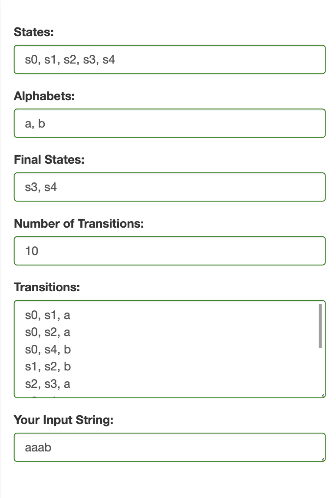
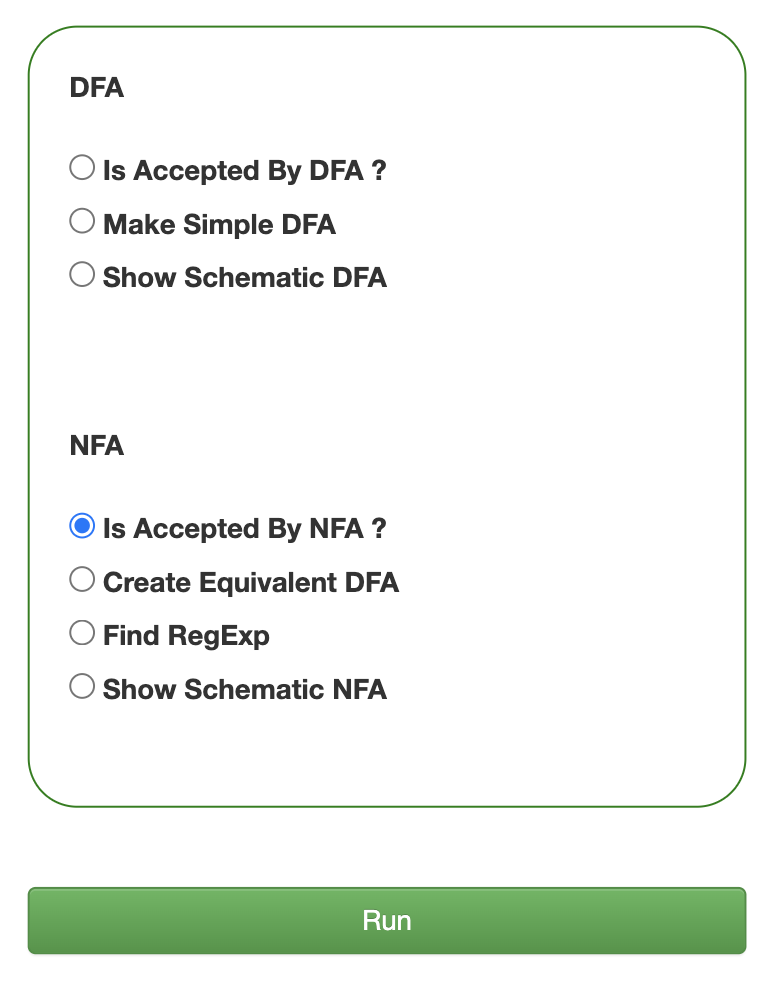
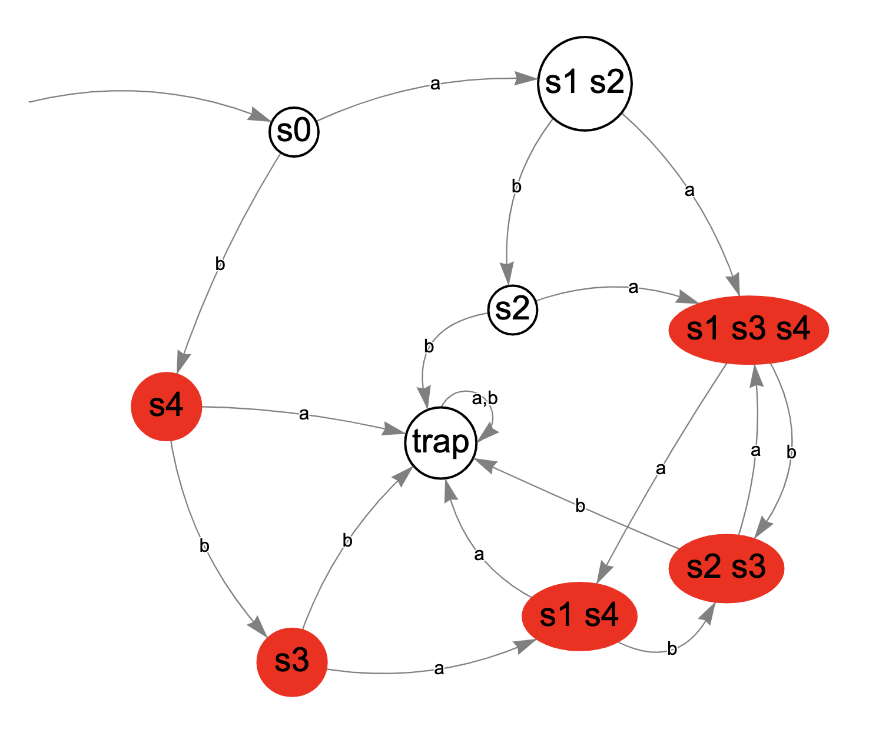

# Finite Automata

This is the theory of formal languages and automata course project.

Project Features:

* Defining the automata states, transitions, final states and input string:

* Choosing the command:

* Visualizing finite automata:

